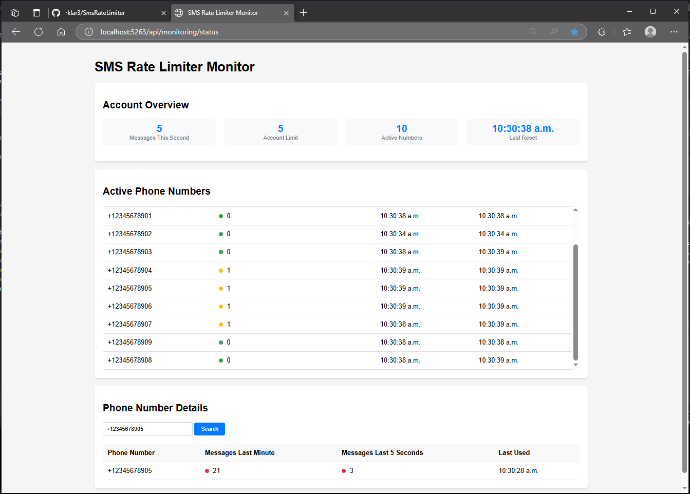

# SMS Rate Limiter

A .NET Core microservice for rate limiting SMS messages with comprehensive monitoring capabilities.

## Features

- Rate limiting per phone number and account
- Real-time monitoring dashboard
- Automatic cleanup of inactive numbers
- Configurable limits and timeouts
- Traffic simulation script

## Configuration

The service can be configured through `appsettings.json`:

```json
{
  "SmsRateLimiter": {
    "PhoneNumberLimit": 3,
    "AccountLimit": 10,
    "InactiveTimeoutMinutes": 5
  }
}
```

## API Endpoints

- `POST /api/sms/check` - Check if a message can be sent
- `GET /api/monitoring/stats` - Get current statistics
- `GET /api/monitoring/active-numbers` - Get list of active phone numbers
- `GET /api/monitoring/phone/{number}` - Get stats for specific phone number

## Monitoring Interface

The service includes a web-based monitoring dashboard accessible at `http://localhost:5263` (or your configured port). The dashboard provides:

- Real-time account statistics
- Active phone number monitoring
- Message rate indicators
- Detailed phone number search



### Monitoring Features

1. **Account Overview**

   - Total messages in current second
   - Account-wide message limit
   - Number of active phone numbers
   - Last reset time

2. **Active Numbers Table**

   - List of all active phone numbers
   - Messages per second with color indicators
   - Last reset and last used timestamps

3. **Phone Number Search**
   - Search for specific phone numbers
   - View messages in last minute
   - View messages in last 5 seconds
   - Last used timestamp

## Traffic Simulation

The project includes a PowerShell script (`simulate-traffic.ps1`) for testing the rate limiter:

```powershell
# Run the simulation
.\simulate-traffic.ps1
```

Features:

- Sends 5 concurrent requests every 10-50ms
- Uses 10 different phone numbers
- Updates stats every 2 seconds
- Shows real-time response from the rate limiter
- Can be stopped with Ctrl+C

## Running the Service

1. Start the .NET application:
   
   ```bash
   dotnet run 
   
   or

   dotnet run --project SmsRateLimiter.csproj
   ```


2. Open the monitoring interface in your browser:

   ```
   http://localhost:5263
   ```

3. Run the simulation script in a separate terminal:
   ```powershell
   .\simulate-traffic.ps1
   ```

## Testing

Run the unit tests:

```bash
dotnet test
```

## License

MIT

## Example Traffic Simulation Output

When running the traffic simulation script, you'll see the monitoring dashboard update in real-time with active phone numbers and their message rates, as shown below:


